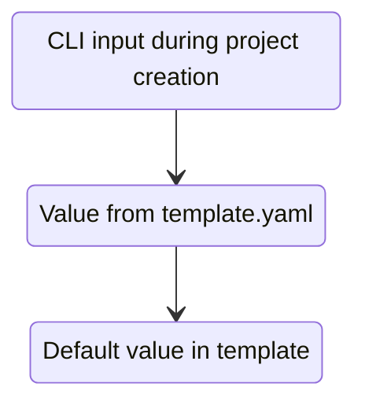

# BoilerGen

BoilerGen goes beyond copy-pasting by automating not only file creation but also seamless code injection (e.g., imports, registrations, and configurations). This solves a key pain point that most boilerplate managers overlook—manual integration errors. Use BoilerGen to quickly build consistent projects from modular boilerplate templates without breaking your codebase.


## Setup

1. [Install Python (3.11+) and pip](https://realpython.com/installing-python/)
2. Clone this repository using    `git clone https://github.com/HumanBot000/BoilerGen.git`
3. Open your preferred command line and `cd` into the project directory.
4. Run `pip install -e .`
5. [Set up your first templates](x)  
6. Run `boilergen create` and follow the instructions.


## Templates

Templates are pre-defined code snippets that can be reused across multiple projects with the same tech stack.  
If you already have a boilerplate repository, you may need to edit some snippets to follow [BoilerGen's tagging rules](x).

Templates are configured in the `boilergen/templates` directory and can be grouped into multiple subgroups [(see examples)](x).


## Tagging

Often, multiple code snippets depend on each other and can't simply be copy-pasted and expected to work (e.g., special API routes need to be registered in the main API definition before startup). To simplify this process, BoilerGen uses a tagging system to automatically adjust your code.

```python
# <<boilergen:imports
from flask import Flask  
# boilergen:imports>>
```

> Depending on your language of choice, you may need to edit the [comment syntax](https://gist.github.com/dk949/88b2652284234f723decaeb84db2576c). BoilerGen will comply with this, but the core syntax remains the same.

### Tagging Syntax Explained

- `<<` indicates an opening tag.
- `>>` indicates a closing tag.
- The comment contains the keyword `boilergen`, identifying it as a special tag.
- After `boilergen`, a colon `:` and a unique identifier (e.g., `imports`) must follow.
- Everything between the tag lines is the tag's content and will be used for code injection.

> ⚠️ You **must not** use this exact syntax (`<<boilergen:...>>`) in any context not intended for BoilerGen. Doing so will corrupt your template.

> ⚠️ Identifiers must be unique **within** a template. We strongly recommend aslo keeping them unique **across** all templates to avoid confusion.

Example of unique identifiers:
```text
boilergen:main-template_imports
boilergen:main-template_routes
```

> Tagging comments must appear **on their own line**, with no additional syntax.

---

## Configurations

To simplify simple variations between projects (e.g., changing the app name or enabling debug mode), templates support configurable variables. These can be set in a `template.yaml` file or supplied interactively during `boilergen create`.

```python
debug = bool("boilergen:config | debug | True")
```

### Configuration Syntax Explained

- Follows the same general structure as tagging.
- Does **not** require a unique identifier after the colon.
- The format is:  
  `boilergen:config | config_name | default_value`
- The `default_value` is optional, but must be provided at some point.

Example:
```python
app.run(
    host="boilergen:config | IP | 0.0.0.0",
    port=int("boilergen:config | port"),
    debug=debug
)
```

> In this example:
> - `host` will be parsed as a `str`
> - `port` will be parsed as an `int`
> - `debug` is already parsed using `bool(...)` above

We **strongly recommend** not placing configuration tags inside **inline comments**, as this may break the syntax highlighting and parsing in your language-specific editor or runtime. BoilerGen tries to **verify data types**, but we **strongly recommend** accepting them as **Strings** and parsing them individually, depending on your language,

---

### Configuration Precedence

The order of precedence for resolving configuration values is:



---


> 🚧 Work in progress: The project is currently not in a usable state. To support development start this repository and tell your friends or co-workers.
